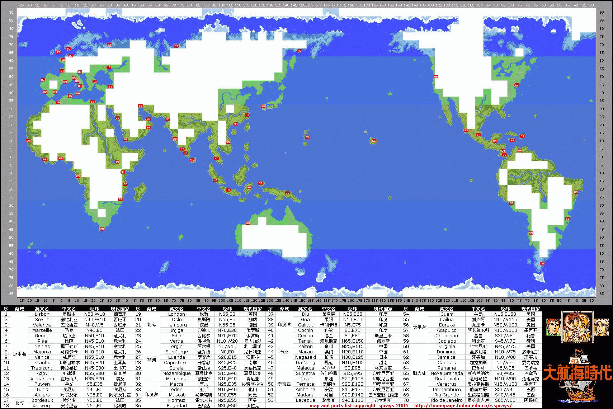

# 一代 大航海时代

> 大航海时代 1（光荣，1990）。本仓库只收录世界地图，其他资料请见官方渠道。

## 关于一代

- **发布年**：1990 年（PC-9801 首发）
- **主角**：里昂·法兰（Léon Franco）
- **特点**：开创性的航海冒险游戏，但系统相对简单，地图小，没有舰队和复杂贸易
- **目标**：环游世界、累积财富、最终获得国王封爵

游戏剧情主要发生在地中海周围，逐步扩展到大西洋、印度洋、东亚水域。

## 运行

中文圈一般直接用三代或二代起步，一代汉化版较少。如需游玩可在 DOSBox / DOSBox-X 中跑 PC 版。
