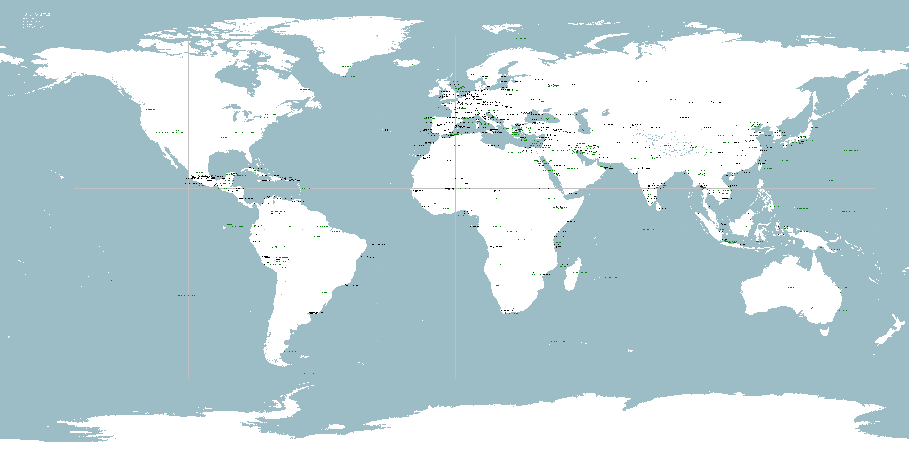

# 三代 大航海时代

> 大航海时代 3（光荣，1996）。本仓库只收录世界地图。

## 关于三代

- **发布年**：1996 年（PC）
- **主角**：玩家自由设定，每个国家有不同剧本
- **特点**：去主角化、自由度极高、全 3D 海域、多船队、详细的航海技术（六分仪、海图、风向、洋流）
- **目标**：发现未知海域、绘制海图、完成各国剧本

三代被许多老玩家认为是系列「最硬核 / 最像航海」的一代，但因为难度高、节奏慢、剧情薄，受众相对小众。

## 运行

只有 Windows 版（一张 CD，600+ MB）。macOS 用户可用 DOSBox / Wine + Win95 模拟器或 PCem 跑。社区有人在贴吧分享过 [DOSBox 运行 Win95 玩三代](https://tieba.baidu.com/p/5905801552) 的方法。
