# 二代 船只图片

二代游戏中 25 种船只的精灵图（sprite icons），尺寸均为 146×96 px，来自 MD 版游戏资源。

> 命名按编号 00-24，对应船只在游戏数据中的索引顺序（西式小船 → 西式中大型船 → 加莱战船 → 东方船型）。
> 部分船型名称对照原版游戏资料整理，标注「待确认」的为根据外形推测，实际玩游戏请以船舶店购买时显示的名称为准。

## 西式小船（单桅 / 双桅）

| 编号 | 图标 | 推测船名 | 主要特征 |
|:---:|:---:|---|---|
| 00 | 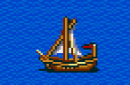 | 平底船 / Barque | 单桅、方形帆、小型货船 |
| 01 | 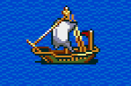 | 三角帆船 / Lateen | 单桅、三角帆，地中海早期常见 |
| 02 | 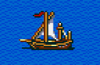 | 中型卡拉维尔 / Caravela | 双桅、方帆+三角，伊比利亚式 |
| 03 | 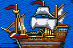 | 大型卡拉克（华丽款）| 多桅、雕饰艉楼、商业用 |
| 04 | 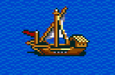 | 双桅小帆船（待确认）| 双桅、方形主帆 |
| 05 | 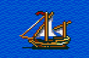 | 武装小帆船（待确认）| 双桅、红色三角帆 |

## 西式中型船（双桅 / 三桅）

| 编号 | 图标 | 推测船名 | 主要特征 |
|:---:|:---:|---|---|
| 06 | 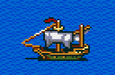 | 卡拉克 / Carrack | 双桅、白帆、有了望台 |
| 07 | 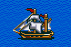 | 武装卡拉克 | 双桅、白帆+红旗、艉楼加高 |
| 08 | 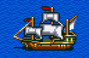 | 大型商船（待确认）| 三桅、白帆、商业 |
| 09 | 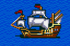 | 战列卡拉克 | 三桅、白帆、舷侧炮窗 |

## 西式大型战舰 / 商船

| 编号 | 图标 | 推测船名 | 主要特征 |
|:---:|:---:|---|---|
| 10 | 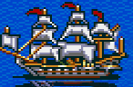 | 武装船（红帆） | 双桅、红帆，海盗外观 |
| 11 | 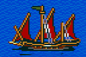 | 大型红帆船（待确认） | 三桅、红帆、武装 |
| 12 | 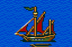 | 武装卡拉维尔 | 三桅、红帆+旗、战斗用 |
| 13 | 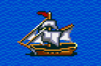 | 双桅红帆 | 双桅、白+红、商业战斗兼用 |
| 14 | 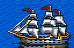 | 双桅大型商船 | 双桅、白帆、低舷 |
| 15 | 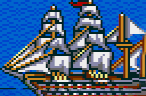 | 大型战舰 / Galleon | 三桅、全白帆、华丽 |
| 16 | 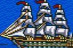 | 大型 Frigate（巡防舰） | 多桅、密集帆、长舰体 |
| 17 | 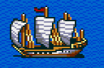 | 弗鲁特船 / Fluyt | 三桅、长艉楼、荷兰式商船 |

## 加莱战船（桨+帆）

| 编号 | 图标 | 推测船名 | 主要特征 |
|:---:|:---:|---|---|
| 18 | 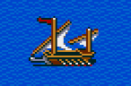 | 武装加莱（小型） | 单桅红帆+桨手 |
| 19 | 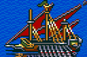 | 大型加莱（Trireme 形） | 大三角帆+双层桨 |
| 20 | 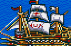 | 大型武装加莱（待确认） | 三桅+多层桨手 |

## 东方船型

| 编号 | 图标 | 推测船名 | 主要特征 |
|:---:|:---:|---|---|
| 21 | 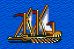 | 海鳅船（待确认） | 平底、单桅、明清式 |
| 22 | 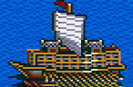 | 中式宝船（小型） | 平底高舷、单方帆 |
| 23 | 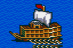 | 中式商船（待确认） | 平底、单桅红帆 |
| 24 | 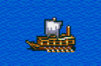 | 车轮舸（待确认） | 平底、单桅、侧轮桨 |

## 总览（缩略图墙）

|   |   |   |   |   |
|:-:|:-:|:-:|:-:|:-:|
|  00 |  01 |  02 |  03 |  04 |
|  05 |  06 |  07 |  08 |  09 |
|  10 |  11 |  12 |  13 |  14 |
|  15 |  16 |  17 |  18 |  19 |
|  20 |  21 |  22 |  23 |  24 |

## 相关资料

- 船只详细数据（转向 / 推进 / 耐久 / 水手数 / 武器 / 容积 / 帆型 / 抗暴 / 造价 / 天数 / 工业值 / 港口 / 介绍）见同级目录 [`../资料/人物港口船只资料.pdf`](../资料/人物港口船只资料.pdf)。
- F5+ 强化版扩展到 37 种船规格，见 [`../强化版/F5+系统详解.md`](../强化版/F5+系统详解.md)。
- 海战中各船的转向 / 推进系数：[`../资料/海战中的转向与推进.md`](../资料/海战中的转向与推进.md)。
