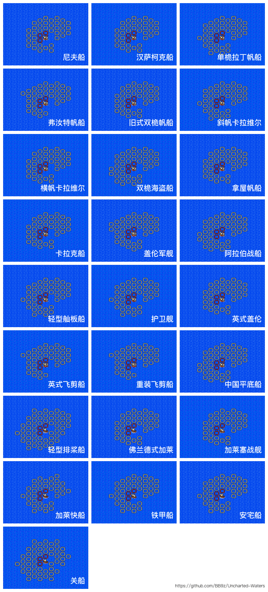

# 海战中的转向与推进 — 全船型

二代游戏中 28 种船在标准条件（**侧面来风、转向 / 推进取出厂默认值**）下，每回合可达格子分布的对比图。可以直观比较不同船型的海战机动性。

## 船型一览（按图中顺序）

| 序号 | 船名 | 大致表现 |
|:---:|---|---|
| 01 | 尼夫船 | 范围小，但分布较均匀 |
| 02 | 汉萨柯克船 | 中等范围，偏前 |
| 03 | 单桅拉丁帆船 | 转向不错，范围中等 |
| 04 | 弗汝特帆船 | 偏纵深，转向一般 |
| 05 | 旧式双桅帆船 | 推进高，扇区大 |
| 06 | 斜帆卡拉维尔 | 范围中，转向较好 |
| 07 | 横帆卡拉维尔 | 推进偏强，纵深远 |
| 08 | 双桅海盗船 | 综合不错，机动性高 |
| 09 | 拿屋帆船 | 范围中等，平衡 |
| 10 | 卡拉克船 | 偏大型，纵深远 |
| 11 | 盖伦军舰 | 范围大，但偏纵深 |
| 12 | 阿拉伯战船 | 转向极佳，扇区圆 |
| 13 | 轻型舢板船 | 范围小但灵活 |
| 14 | 护卫舰 | 平衡型，机动性好 |
| 15 | 英式盖伦 | 大型，范围广 |
| 16 | 英式飞剪船 | 转向 / 推进都强 |
| 17 | 重装飞剪船 | 范围最大之一 |
| 18 | 中国平底船 | 大范围，分布均匀 |
| 19 | 轻型排桨船 | 推进低，转向高，扇区扁 |
| 20 | 佛兰德式加莱 | 中等范围 |
| 21 | 加莱塞战舰 | 大型加莱、范围广 |
| 22 | 加莱快船 | 转向极佳 |
| 23 | 铁甲船 | 大型，纵深远 |
| 24 | 安宅船 | 中等偏大，平衡 |
| 25 | 关船 | 中等范围 |

> 顺序与编号以图为准，与 [`../船只图片/`](../船只图片/) 中的 sprite 编号 **不一定一致** —— 后者是 MD ROM 的资源顺序，本图来自玩家自整理的攻略截图。

## 选船建议

- **追求灵活机动**：阿拉伯战船、加莱快船、英式飞剪船
- **追求纵深推进**：盖伦军舰、铁甲船、卡拉克船
- **均衡选手**：护卫舰、英式盖伦、双桅海盗船
- **早期过渡**：尼夫船、汉萨柯克船

## 数据来源

- 截图来自 GitHub `BB9z/Uncharted-Waters` 仓库（见图右下角水印）。
- 实际游戏中风向、船帆受损、船员素质都会改变实际可达范围，本图仅作为基础参考。

详细的「转向 vs 推进」原理见 [`海战中的转向与推进.md`](海战中的转向与推进.md)。
