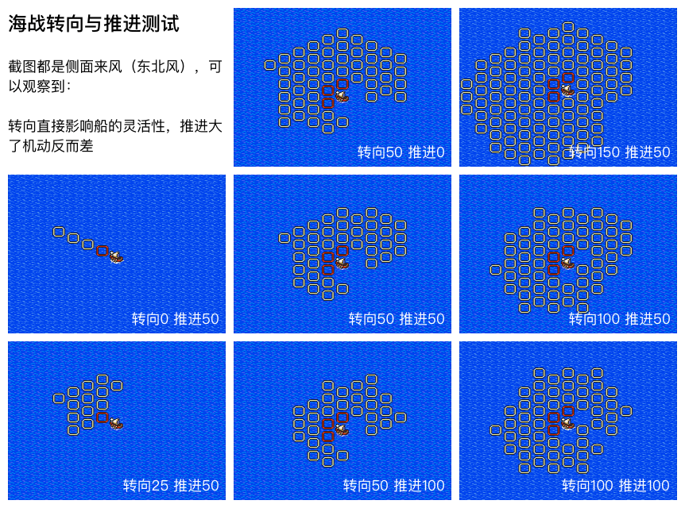

# 海战中的转向与推进

二代海战的「转向」与「推进」是两个独立的船只属性，直接决定每回合可移动的格子分布。同一个回合可走到的格子集合 ≈ 一个由这两个属性决定的椭圆 / 心形扇区。

## 测试条件

- 所有截图都是 **侧面来风（东北风）**
- 主角船图标位于中央方格，红框表示「本回合可达的格子」
- 通过对比不同 `转向 / 推进` 组合，可以直观看出两个属性各自的影响

## 观察结论

> **转向直接影响船的灵活性；推进过大反而会让机动反而变差。**

详细对比：

| 组合 | 表现 | 备注 |
|---|---|---|
| 转向 0、推进 50 | 只能直线前进，几乎不能转向 | 推进无用武之地 |
| 转向 25、推进 50 | 可有限转向，但活动范围依然小 | 偏向直线 |
| 转向 50、推进 50 | 标准配置，扇形覆盖均匀 | 综合最佳 |
| 转向 100、推进 50 | 几乎可以原地掉头 | 活动范围反而比 50/50 大 |
| 转向 50、推进 0 | 可以原地转向，但只能小幅前进 | 推进 0 不会停滞 |
| 转向 50、推进 100 | 推进过大反而难以转弯 | 直线冲刺型 |
| 转向 100、推进 100 | 全方位铺开，但纵深稍弱 | 全能型 |
| 转向 150、推进 50 | 超出常规范围，扇区比 100 更大 | F5+ 强化版才有 |

## 调整方向

- **优先堆转向**：在选船和升级时，转向值 > 推进值。
- **推进 50 是甜区**：再高会牺牲转向带来的实际机动。
- **逆风 / 顺风** 会进一步影响推进，但不影响转向，故转向更稳定可靠。

## 全 28 种船型的实际表现

每种船在 50/50 配置下的扇区图见 [`海战中的转向与推进-全船型.md`](海战中的转向与推进-全船型.md)。

## 数据来源

- 标注来自 GitHub `BB9z/Uncharted-Waters` 仓库的整理图。
- 测试时建议自己开档对比，因为不同船型在不同风向下表现差异较大。
